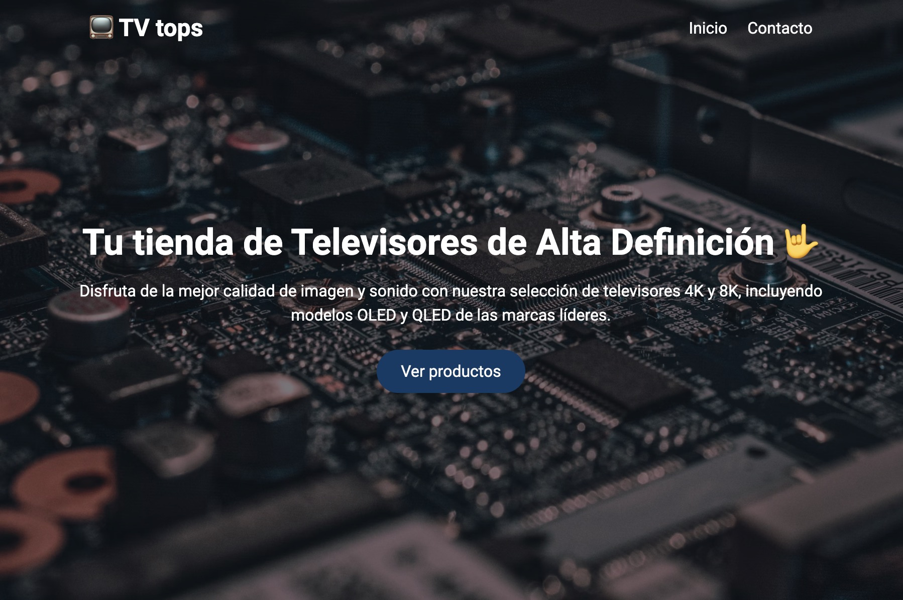
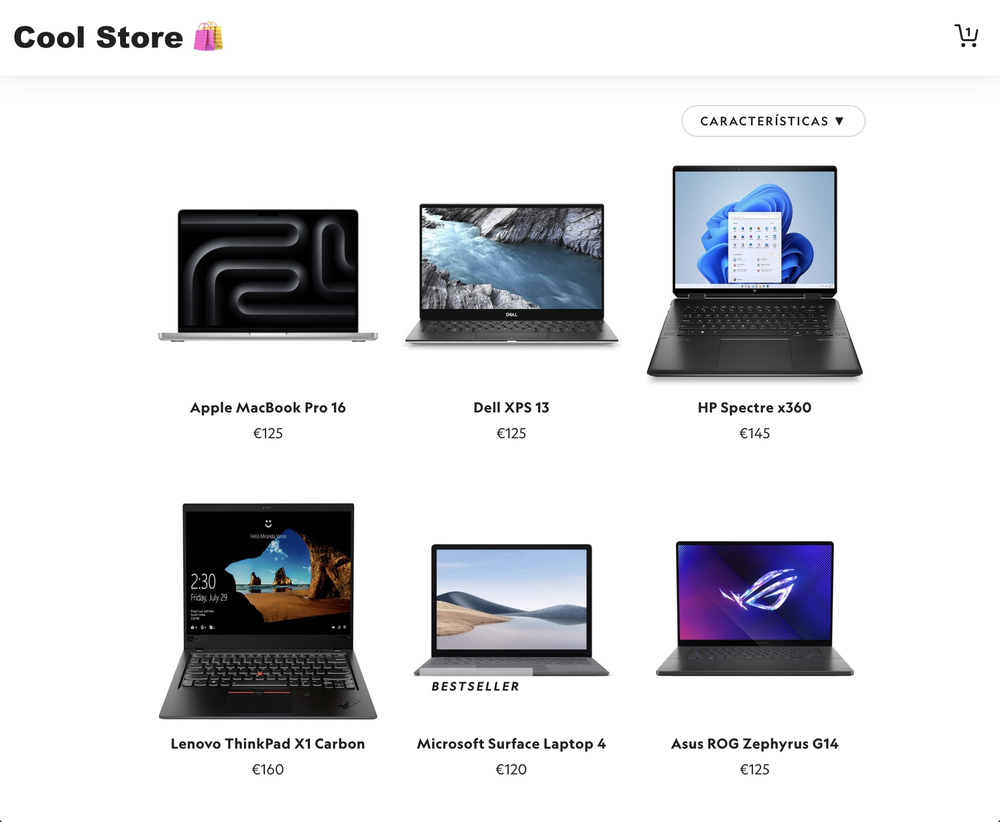
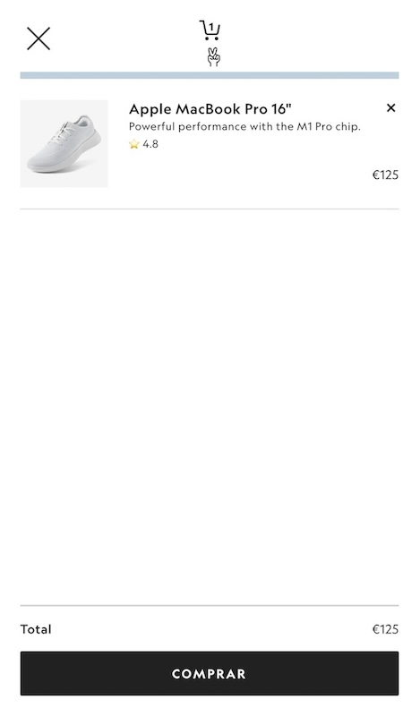
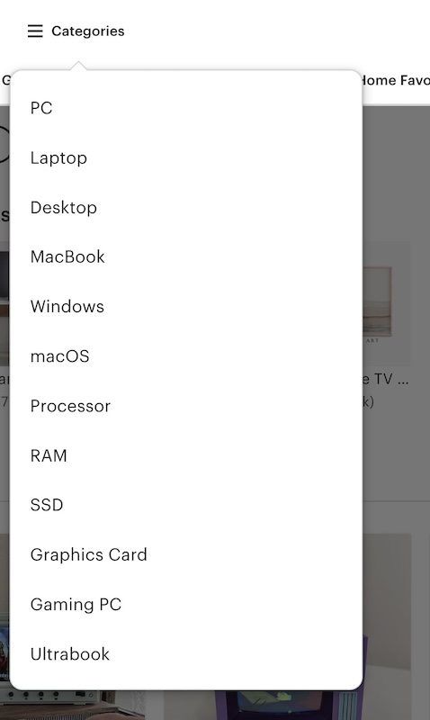

# **🛍️ Proyecto:** Tienda online

**ℹ️ Descripción del proyecto:**
Desarrollar la interfaz de una tienda online que venda productos tecnológicos, ejemplos:

Este es el endpoint de la API a utilizar [https://products-foniuhqsba-uc.a.run.app/](https://products-foniuhqsba-uc.a.run.app/) 

- PCs: [PCs](https://products-foniuhqsba-uc.a.run.app/PCs)
- Smartwatches and gadgets: [Smartwatches and gadgets](https://products-foniuhqsba-uc.a.run.app/Smartwatches%20and%20gadgets)
- Drones: [Drones](https://products-foniuhqsba-uc.a.run.app/Drones)
- Cameras: [Cameras](https://products-foniuhqsba-uc.a.run.app/Cameras)
- Games: [Games](https://products-foniuhqsba-uc.a.run.app/Games)
- TVs: [TVs](https://products-foniuhqsba-uc.a.run.app/TVs)

El objetivo es crear una experiencia de usuario atractiva y funcional que integre los conceptos y tecnologías vistos en clase.

**⚙️ Tecnologías y conceptos que debes utilizar:**

- **Grid y Flexbox:** Para diseñar el layout responsivo de la página, organizando productos y secciones de manera eficiente.
- **CSS Popovers + Anchors:** Para mostrar información adicional de productos o notificaciones al usuario de forma interactiva.
- **Dialog (HTML element):** Para implementar modales de confirmación o mensajes emergentes.
- **Web Components:** Para crear componentes reutilizables como tarjetas de producto, menús de navegación y botones.
- **Tailwind CSS:** Para estilizar la interfaz rápidamente utilizando clases utilitarias y personalización de estilos.

---

**Funcionalidades a implementar:**

1. **Página de inicio (2.5pts):**
   - **Header**: Crea un header en el que incluyas el logo de la tienda y un ícono de un carrito de la compra.
   - **Banner principal:** Crea una sección con el título de la tienda y una imágen de fondo. (Tip: Utiliza **Flexbox** para centrar contenido promocional con Tailwind)
   - **Catálogo de productos (Grid):** Organizada con **Grid** (Ej: un grid de 3 columnas en escritorio) para mostrar múltiples productos de manera atractiva.
   - **Catálogo de productos (Grid & Flex):** Añade un botón para cambiar de vista de productos (Ej: Grid o Flexbox). Puedes usar flexbox y grid.
   - **Cards de producto:** Crear un **Web Component** para las tarjetas que incluyan `imagen`, `nombre`, `rating`, `fecha`, `precio` y botón de "Agregar al carrito", estilizadas con **Tailwind CSS**.
   - Un ejemplo de la estructura del home (Ojo: no contiene toda la información que se pide en el enunciado)
   
   - Un ejemplo del grid de productos:
   

2. **Detalle del productos (1.5pts):**
   - **Página de detalle:** Al hacer clic en un producto, mostrar una página con información detallada, incluyendo la imágen, descripción , precio y sus características `features`.
   - **Botón de compra:** Incluir un botón para añadir el producto al carrito.

3. **Popup informativo del producto (1.5pts):**
   - **Popover de información (Ver características):** Al hacer clic la card de un producto en "Ver características", mostrar los detalles adicionales utilizando **CSS Popovers + Anchors**.
   - Por ejemplo: mostar las características (`features` o `tags`) del producto, color, almacenamiento, resolución, etc (esta información dependerá de la API que utilices).

4. **Carrito de compras (2.5pts):**
   - **Resumen del carrito:** Un componente fijo o desplegable que muestre los productos añadidos, utilizando **Flexbox** para la lista de items añadidos.
   - **Carrito vacío:** Mostrar un mensaje o botón para agregar productos al carrito si está vacío.
   - **Total y botón de compra:** Calcular el total de la compra y mostrar un botón para proceder al pago.
   - **Proceso de pago:** Al dar clic al botón de compra, mostrar un mensaje de agradecimiento y confirmación de la compra (usa un dialogo html para ello). Y vacía el carrito de la compra.
   - **Ícono animado [extra]:** Al agregar productos al carrito se debe mostrar un icono con un contador y la cantidad de productos añadidos.
   - Un ejemplo de un carrito:
   
   

5. **Menú de carácteristicas (2pts)**:
   - **Menú popover + anchors:** Crear un menú responsivo para filtrar productos por etiqutas `tags`, utilizando **CSS Popovers + Anchors**.
   - Este es el enlace en el cual se detalla los tipos de productos [REAME_tipos.md](./REAME-tipos.html)
   - Un ejemplo de un menu popover con las categorías:
   
   

**⚠️ Importante:**

   - No usar ningún framework de CSS como Bootstrap o Foundation.
   - No usar ningún framework de JavaScript como React o Vue.
   - Asegurar que la interfaz sea responsiva y accesible en Desktop/Mobile.
   - Personalizar el diseño y los estilos para que se adapten a la temática de la tienda.
   - Se debe de usar en lo posible Web Components, Grid, Flexbox, CSS Popovers + Anchors, Dialog y Tailwind CSS.

**👀 Temas a considerar:**
   - **Tema personalizado:** Adaptar colores, tipografía y otros estilos para alinearse con la identidad de la tienda.
   - **Componentes estilizados:** Aprovechar las clases utilitarias para crear componentes consistentes y atractivos.
   - **Web Components reutilizables:** Crear un menú responsivo, estilizados con **Tailwind CSS** y **Popovers**.
   - **Navegación móvil:** Asegurar que el menú funcione adecuadamente en dispositivos móviles, utilizando **Flexbox** y **Grid**.
   - **Diseño responsive:** Garantizar que la interfaz se adapte a diferentes tamaños de pantalla utilizando **Grid** y **Flexbox**.
   - **Buenas prácticas de accesibilidad:** Incluir etiquetas semánticas y alternativas textuales para mejorar la experiencia de todos los usuarios.

**👌 Desafíos adicionales:**
- **Implementar un buscador**
- **Ordenar productos por precio o rating**
- **Agregar un slider en el home para mostrar productos destacados**
- **Crear un formulario de contacto**

---
